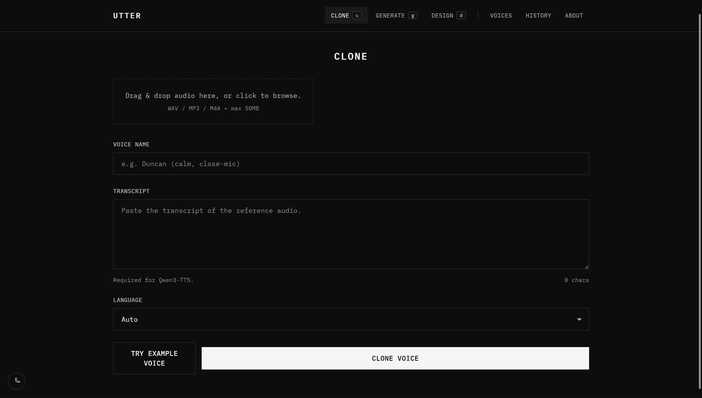
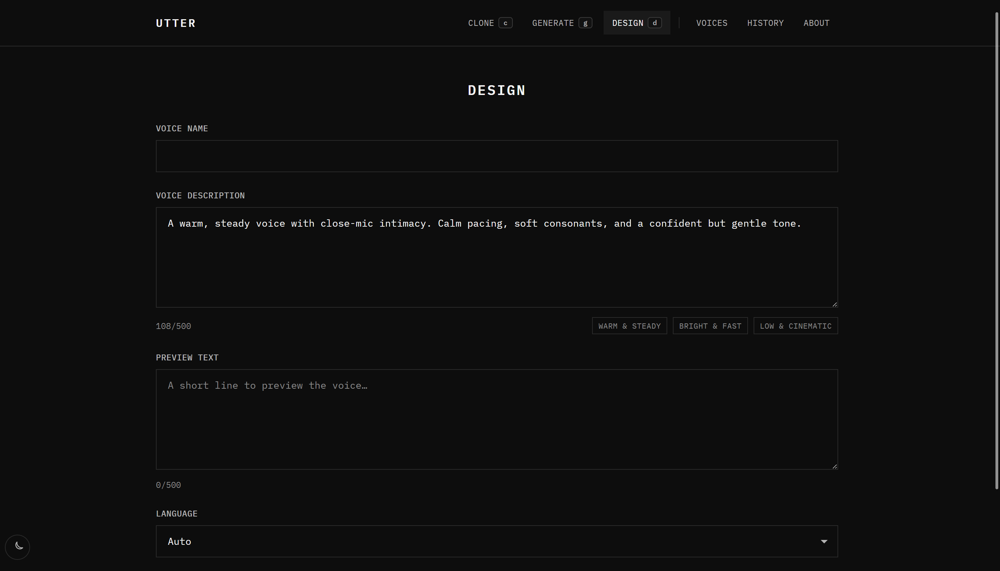
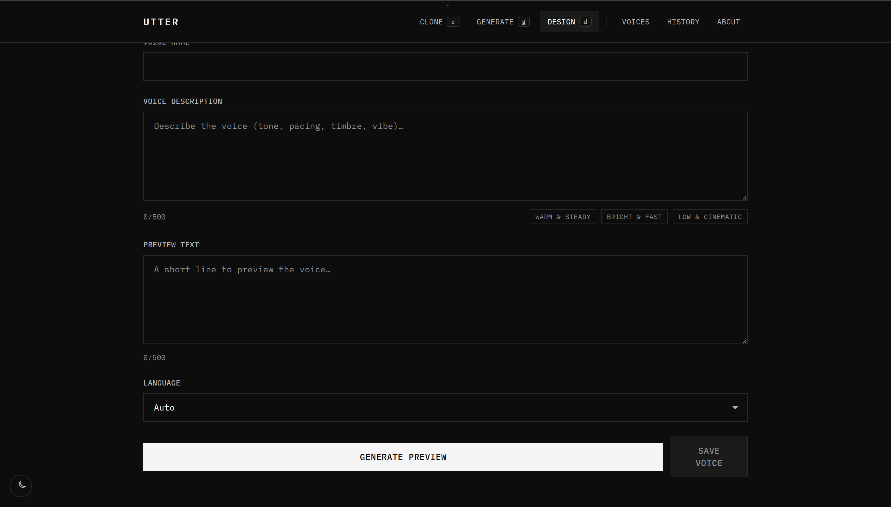
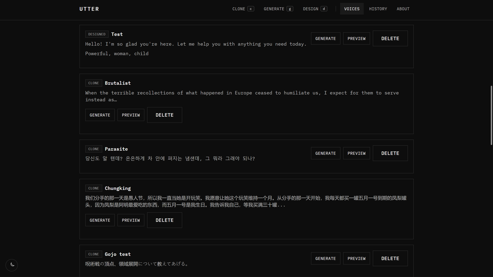
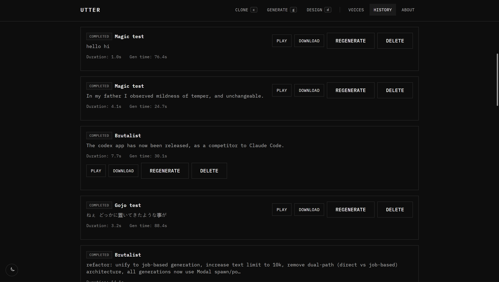

# Post-frontend refactor UI/UX fixes - implementation plan (2026-02-03)

This is the final plan before implementation: it turns the raw notes + screenshots into an implementable, design-consistent set of changes, grounded in how the current code is structured.

## Codebase context (where these changes live)

- Routes + shell: `frontend/src/app/Layout.tsx` (nav, theme toggle, main container, global shortcuts via `frontend/src/app/useGlobalShortcuts.ts`)
- Pages: `frontend/src/pages/Clone.tsx`, `frontend/src/pages/Generate.tsx`, `frontend/src/pages/Design.tsx`, `frontend/src/pages/Voices.tsx`, `frontend/src/pages/History.tsx`, `frontend/src/pages/About.tsx`
- UI primitives (current "design system"): `frontend/src/components/ui/*` (notably `frontend/src/components/ui/Button.tsx`)
- Backend constraints we should mirror in UI copy/tooltips:
  - Reference audio validation: `backend/services/audio.py` and `backend/config.py` (currently `MIN_AUDIO_DURATION_SECONDS = 3`, `MAX_AUDIO_DURATION_SECONDS = 300`)
  - Generation timing/estimation: `/api/generate` returns `estimated_duration_minutes` (see `backend/main.py`)
  - Legacy UI copy we can borrow: `backend/templates/design.html` has a good "tips" section we can reuse for Info guides

## Guiding principles (design intent)

1. Consistency over cleverness: every action row should feel like it comes from the same component set (same height, padding, typography, focus ring).
2. Actions stay stable: long text should expand the content area, not push primary actions out of view or onto a new row (desktop/tablet).
3. Responsive by design: on mobile, it is OK for actions to stack below content, but spacing and button sizing should remain consistent and intentional.
4. No hard-coded "facts" (as much as possible): prefer using existing API responses (e.g. `/api/generate` estimates) and backend validation errors as the source of truth. When we must show static guidance (e.g. reference-audio duration), keep it centralized in the frontend to avoid drift.

---

## Cross-cutting fixes (do these first)

### 1) Normalize action control sizing (root cause of "button heights differ")

Observation: many pages mix `Button` (px-6/py-3) with ad-hoc `<a>` / `<button>` styles (px-3/py-2/text-[12px]). This is why list actions like Generate/Preview/Delete look mismatched.

Implementation approach (low-risk):

- Extract a shared class generator from `frontend/src/components/ui/Button.tsx`:
  - `buttonStyles({ variant, size, block, loading })` returning a className string
  - Keep `Button` as the canonical element, but make the styles reusable for anchors and `NavLink`
- Add a `size?: 'sm' | 'md'` to `Button` (default `md`), and update list actions to `size="sm"`.
- Create thin wrappers for non-`<button>` actions:
  - `ButtonLink` for React Router `NavLink`
  - `ButtonAnchor` for download links

Acceptance criteria:

- All action controls in Voices/History match in height and typography.
- Focus rings and hover states remain consistent.

### 2) Standard "row card" layout to prevent action wrap on long text

Observation: `Voices` and `History` card headers use `flex flex-wrap ... justify-between`, so long text forces the action cluster to wrap below.

Implementation approach:

- Move the card header layout to a responsive grid:
  - Mobile: single column (content first, actions below)
  - `md+`: two columns: `minmax(0,1fr)` for content + `auto` for actions
- Either:
  - Implement inline (fast), or
  - Extract `RecordRow` / `RowCardHeader` component used by both `frontend/src/pages/Voices.tsx` and `frontend/src/pages/History.tsx`.

Acceptance criteria:

- On `md+`, actions stay pinned top-right regardless of text length.
- On small screens, actions stack but keep consistent spacing and sizing.

### 3) Info guides pattern ("minimal i")

Goal: add a minimal "i" affordance that works for hover and click, is keyboard accessible, and does not add visual clutter.

Implementation approach (no new deps):

- Add `frontend/src/components/ui/InfoTip.tsx` with:
  - A small icon button (`aria-label="Info"`)
  - A popover panel that opens on click (and optionally on hover for fine pointer devices)
  - Escape to close, click-outside to close
  - `aria-expanded`, `aria-controls`, and an `id` for the panel
- Reuse it next to page titles and/or key field labels:
  - Clone: next to "Clone" title or "Transcript" label
  - Generate: next to "Text" label or "Generate" title
  - Design: next to "Voice Description" and "Preview Text" labels

Important: do not require new backend endpoints for this. Use existing endpoints + backend error messages; keep any static guidance centralized in the frontend.

---

## Page-level plans

## Clone

### Issues (from screenshot)

- "Try Example Voice" vs "Clone Voice" should feel like a matched pair (alignment + sizing).
- Drag/drop area should fill available width and read as a primary dropzone affordance.
- Remove the literal copy "Required for Qwen3-TTS."
- Example voice name should be "ASMR" (not "Duncan").

### Implementation plan

1. Dropzone width + hierarchy
   - In `frontend/src/pages/Clone.tsx`, add `w-full` to the dropzone container (currently the button is not explicitly full width).
   - Consider a consistent "card" look (match other bordered panels): set a min height and ensure internal copy is vertically centered.
2. Action row consistency
   - Replace the current action layout with a `grid gap-3 sm:grid-cols-2` so both buttons align in height and visual rhythm.
   - Decide whether both buttons should be full-width at `sm+` (recommended for symmetry) or primary full-width and secondary auto.
3. Copy + example naming
   - Update `onTryExample()` to set the example `name` to `"ASMR"` (or `"ASMR (soft, close-mic)"` if we want the style baked in).
   - Replace `{transcriptRequired ? 'Required for Qwen3-TTS.' : 'Optional.'}` with copy that does not mention the provider by name, e.g.:
     - "Required for voice cloning." / "Optional."
     - or "Required for your current provider." (accurate but provider-agnostic)
4. Keep UI guidance aligned with current backend validation
   - Backend constraints are currently 3s-5min and 50MB (see `backend/config.py` / `backend/services/audio.py`).
   - For this pass, do not change backend APIs or add endpoints; update UI copy to match the current backend validation rules.
   - If product requirements differ (e.g. prefer 3s-60s), track that as a separate backend/config change ticket (no new endpoints required, but out of scope for this UI/UX plan).
5. Optional UX improvement: client-side duration feedback
   - After file select/drop, compute duration in the browser and show it under the dropzone.
   - Keep the displayed min/max centralized in the frontend (single constant), and rely on backend validation errors as the final authority.

## Generate

### Implementation plan

1. Add InfoTip with "what to expect"
   - Mention max characters (10,000 in UI), and that long texts may be chunked/long-running.
   - Prefer showing the backend-provided estimate: `/api/generate` returns `estimated_duration_minutes`.
2. Progress panel: include estimate
   - When a generation starts, show `estimated_duration_minutes` (if present) alongside elapsed time (already available from `/api/generate` response).
   - Avoid hard-coded timing heuristics; treat the estimate as the source of truth (or say "varies by load").

## Design

### Issues (from screenshots)

- Example buttons should populate the "Voice Name", not just the description.
- "Generate Preview" and "Save Voice" should read as a matched pair (same height/width rhythm).

---

### Implementation plan

1. Upgrade example presets
   - Change `EXAMPLES` in `frontend/src/pages/Design.tsx` to include `name` (and optionally `previewText`).
   - On click, set `name` + `instruct` (+ maybe `text` if `text` is empty) to reduce "blank form" friction.
2. Button pairing
   - Use the same layout strategy as Clone: `grid gap-3 sm:grid-cols-2`.
   - Ensure both actions use the same button `size` and consistent width rules.
3. Add a Design InfoTip
   - Borrow from `backend/templates/design.html` (tips + "preview becomes reference" concept).
   - Clarify: no reference audio needed, but the saved preview audio becomes the reusable voice for generation.

## Voices

### Issues (from screenshot)

- Generate/Preview/Delete control heights differ.
- "Designed" voices lack labeled differentiation between the saved transcript vs the design prompt.
- Long text causes the action cluster to drop below (desktop).

### Implementation plan

1. Unify the card header layout (shared with History)
   - Replace header flex-wrap layout with the two-column grid approach described above.
2. Unify action button styling
   - Use `Button` (with `size="sm"`) for Generate/Preview/Delete; replace bespoke anchor/button styles with `buttonStyles()` or wrapper components.
3. Add explicit labels for the two text blocks
   - For `v.source === 'designed'`:
     - Label `reference_transcript` as "Preview text (saved transcript)"
     - Label `description` as "Design prompt"
   - For `v.source !== 'designed'`:
     - Label `reference_transcript` as "Reference transcript" (or show "Transcript missing" if null)
4. Optional: clamp + expand
   - Keep actions pinned via layout regardless, but also consider `line-clamp-*` + "Show more" to reduce scroll fatigue.

## History

### Issues (from screenshot)

- Same long-text + action wrap problem as Voices.
- Button sizing inconsistencies (mix of custom buttons, links, and `Button`).

### Implementation plan (should share code with Voices)

1. Adopt the same "row card header" grid layout.
2. Standardize actions to `Button` / `buttonStyles()` (Play, Download, Regenerate, Delete).
3. Keep the current metadata row (duration + gen time), but ensure it does not collide with action layout at small widths.

## About

### Goal

Make About a short feature + expectations page:

- Mention Qwen3-TTS briefly (no tech stack bullets).
- Provide practical constraints and "how it works" in user language.

### Implementation plan

1. Rewrite `frontend/src/pages/About.tsx` into 3 parts:
   - "What Utter does" (Clone / Design / Generate)
   - "Constraints and tips" (formats, transcript requirement, approximate timings)
   - "How to get best results" (short actionable bullets)
2. Source numbers from existing backend behavior (no new endpoints):
   - Reference audio duration range
   - File size limit (50MB in UI; backend also has `MAX_FILE_SIZE_MB`)
   - Text limits (UI uses 10k; backend validation should match or we should align them)

---

## No new backend endpoints (explicit constraint)

This plan intentionally avoids adding new backend API endpoints (including anything that would require additional Modal endpoint deployments).

Implementation notes:

- Use existing `/api/languages` for provider/languages and existing `/api/generate` for `estimated_duration_minutes`.
- For Clone/Design "static" guidance (audio duration ranges, typical preview time), centralize the values in the frontend (one file) and treat backend validation errors as authoritative.
- If we later want fully dynamic "capabilities" copy, consider extending an existing response shape rather than adding a new endpoint, but that is out of scope for this plan.

## QA checklist (manual)

- Breakpoints: 375px, 768px, 1024px+.
- Keyboard: Tab order, Escape closes InfoTip/popovers, focus ring visible.
- Long text: very long transcripts/descriptions do not move action cluster on desktop.
- Visual consistency: all action buttons in Voices/History share height/padding/typography.
- Copy consistency: clone duration + transcript requirement match backend rules and provider behavior.
