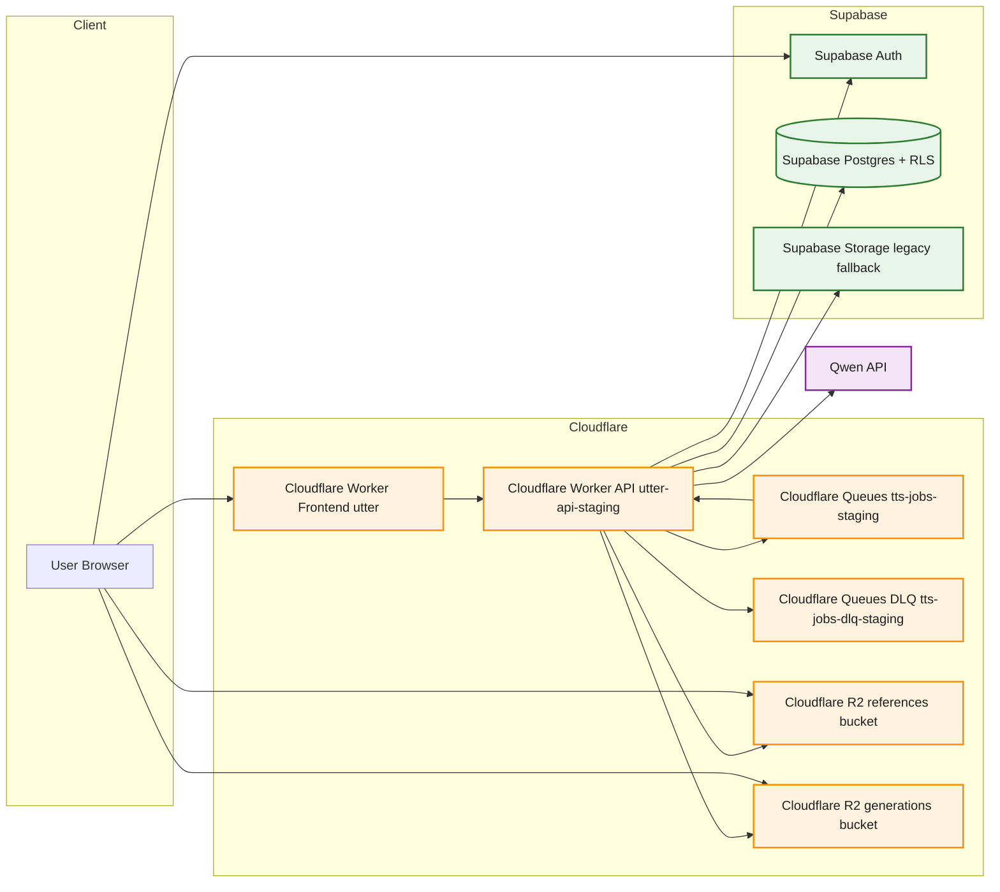

# Explainer: Current Stack and Equivalence

## Current stack (as of 2026-03-02)

1. Frontend delivery: Cloudflare Worker serving SPA assets
2. API runtime: Cloudflare Worker (`/api/*` contract retained)
3. Object storage: Cloudflare R2 primary with compatibility fallback mode in staging
4. Background work: Cloudflare Queues for selected async paths
5. System of record: Supabase Postgres/Auth/RLS/credits/billing logic
6. Inference providers: Qwen and Modal integrations preserved

## Complete technology topology

Notes:
1. Browser app-data traffic stays on `/api/*`; direct Supabase data-plane calls are not the default app contract.
2. Supabase remains source of truth for Auth, Postgres, RLS, and billing/credits invariants.
3. R2 is primary object storage path, with staged hybrid fallback to Supabase Storage for legacy objects.
4. Queue Q1 handles selected async paths; failed deliveries route to DLQ for operational recovery.

## Old vs current equivalence map

| Concern | Previous dominant path | Current dominant path | Equivalence status |
|---|---|---|---|
| Frontend hosting | Vercel | Cloudflare Worker | Parity expected; verify routing/cache behavior |
| API runtime | Supabase Edge Functions | Cloudflare API Worker | Route contract preserved under `/api/*` |
| DB/Auth/RLS | Supabase | Supabase | Unchanged system-of-record |
| File storage | Supabase Storage | R2 (with staging fallback mode) | In transition; hybrid mode protects backward reads |
| Async orchestration | In-request/legacy async paths | Queue-enabled selected paths | Partial rollout; verify idempotency + failure handling |
| Billing/credits invariants | Supabase RPC/ledger | Supabase RPC/ledger | Must remain equivalent |

## What "feature-parity" means here

1. Same user-visible outcomes for all supported flows
2. Same security and access-control guarantees (or stronger)
3. Same API contract for frontend client integration
4. No billing/credits invariant regressions

## Known non-equivalence that is intentional

1. Runtime provider changed (Supabase Edge -> Cloudflare Workers)
2. Storage backend migration path (`supabase`/`hybrid`/`r2`) is explicit
3. Queue adoption introduces asynchronous boundaries for selected paths

## Validation dependencies

1. `01-feature-parity-verification-plan.md`
2. `02-dev-and-staging-runtime-evaluation-plan.md`
3. `04-security-evaluation-and-pentest-plan.md`
4. `05-deployed-frontend-scan-and-performance-plan.md`
