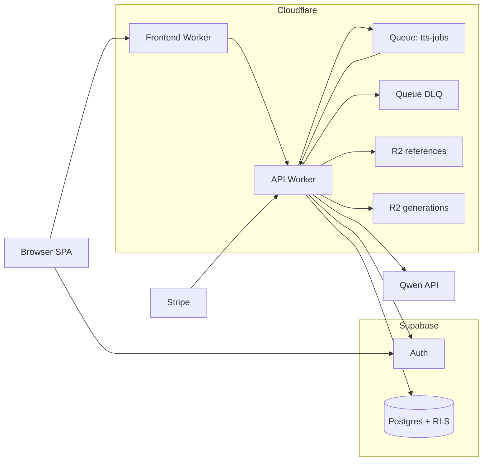

# Architecture: Cloudflare + Supabase (Simplified)

Last updated: 2026-03-03

This is the active architecture.

## Topology

## Responsibilities by layer

- Browser/frontend:
  - Supabase Auth session lifecycle
  - Calls app API on `/api/*`
- Frontend Worker:
  - Serves SPA assets
  - SPA fallback routing
  - Proxies `/api/*` to API Worker (service binding)
- API Worker:
  - Authn/authz checks
  - API contract and validation
  - Queue produce/consume for async generate/design preview
  - Storage signing/proxy and R2 adapter
  - Credits/billing orchestration via Supabase RPC + Stripe webhook handling
- Supabase:
  - Source of truth for users, voices, generations, tasks, credits, billing
  - RLS and DB invariants
- Cloudflare storage/async:
  - R2 for reference/generation objects
  - Queues for async provider workloads and retry/DLQ

## Request flow (critical paths)

1. Clone flow
- `POST /api/clone/upload-url` -> signed upload URL
- Browser uploads object
- `POST /api/clone/finalize` -> clones qwen voice + inserts voice row

2. Generate flow (queue-first)
- `POST /api/generate` -> creates task + generation row, debits credits, enqueues qwen start message
- Queue consumer executes provider call + storage finalization
- `GET /api/tasks/:id` -> read-only task/result view (no provider polling/writes)
- `GET /api/generations/:id/audio` -> signed playback URL redirect

3. Voice design flow (queue-first)
- `POST /api/voices/design/preview` -> creates task + debits credits/trial, enqueues qwen design message
- Queue consumer writes preview result to storage/task row
- `POST /api/voices/design` -> persists designed voice from completed preview task

4. Billing flow
- `POST /api/billing/checkout` -> Stripe Checkout session
- `POST /api/webhooks/stripe` -> signature verified, idempotent credits/billing updates

## Storage model

- R2-only object lifecycle for `references` and `generations`.
- Signed upload/download tokens are HMAC-based via `STORAGE_SIGNING_SECRET`.
- No Supabase Storage runtime fallback branches.

## Trust boundaries

1. Browser -> `/api/*`
- untrusted input boundary
- bearer token required for protected routes

2. API Worker -> Supabase
- anon key + forwarded JWT for RLS-scoped reads
- service-role key only for privileged server-owned operations

3. API Worker -> R2/Queues/Qwen
- queue consumers must be idempotent and terminal-safe
- cancelled tasks must not be overwritten back to completed

4. Stripe -> webhook route
- verified via Stripe signature, not user JWT

## Invariants that must not regress

- `/api/*` request/response contracts for frontend
- credits ledger idempotency
- billing webhook idempotency
- RLS-owned data isolation by `user_id`
- queue-first async execution (no route-side finalize fallback)
