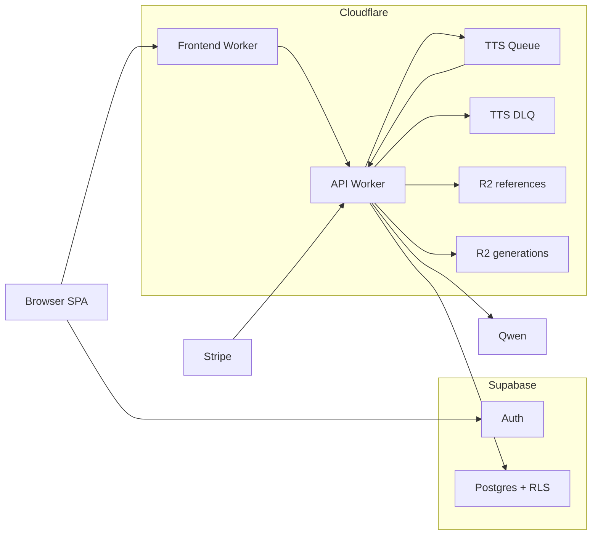

# Architecture

Read this when you need the active topology, request flow, and boundaries.

## Topology

## Key Files

- API entry: `workers/api/src/index.ts`
- Frontend worker entry: `workers/frontend/src/index.ts`
- Queue messages: `workers/api/src/queues/messages.ts`
- Queue consumer: `workers/api/src/queues/consumer.ts`
- API bindings: `workers/api/wrangler.toml`
- Frontend bindings: `workers/frontend/wrangler.toml`

## Layer Responsibilities

- Browser SPA:
  - Supabase auth session lifecycle
  - UI routes
  - task polling
- Frontend Worker:
  - serves built SPA assets
  - SPA fallback routing
  - proxies `/api/*` to the API Worker
- API Worker:
  - auth checks
  - route validation
  - signed storage upload/download flow
  - queue submission and consumption
  - credits and billing orchestration
  - provider integration
- Supabase:
  - durable data
  - auth
  - RLS
  - credit ledger and billing events
- Cloudflare storage and async:
  - R2 for reference and generation audio
  - Queues for long-running TTS jobs

## Critical Flows

### Clone

1. `POST /api/clone/upload-url` returns a signed upload URL for the API storage route.
2. Browser uploads reference audio through `/api/storage/upload`, and the Worker writes it to R2.
3. `POST /api/clone/finalize` verifies the upload, charges trial or credits, clones the qwen voice, inserts the `voices` row.

Key code:

- `workers/api/src/routes/clone.ts`

### Generate

1. `POST /api/generate` validates voice ownership and qwen provider metadata.
2. API inserts a `generations` row and a `tasks` row, debits credits, and enqueues `generate.qwen.start`.
3. Queue consumer calls qwen, downloads audio, uploads to R2, finalizes `generations`, finalizes `tasks`.
4. Frontend polls `GET /api/tasks/:id`.
5. Playback uses `GET /api/generations/:id/audio`.

Key code:

- `workers/api/src/routes/generate.ts`
- `workers/api/src/queues/messages.ts`
- `workers/api/src/queues/consumer.ts`

### Design Preview

1. `POST /api/voices/design/preview` validates inputs and charges trial or credits.
2. API inserts a `tasks` row and enqueues `design_preview.qwen.start`.
3. Queue consumer generates preview audio and stores it in R2.
4. `POST /api/voices/design` turns the completed preview task into a saved `voices` row.

Key code:

- `workers/api/src/routes/design.ts`

### Billing

1. `POST /api/billing/checkout` creates a Stripe Checkout session for a prepaid pack.
2. `POST /api/webhooks/stripe` verifies the Stripe signature.
3. Webhook processing inserts `billing_events` and grants credits through the ledger RPC path.

Key code:

- `workers/api/src/routes/billing.ts`

## Trust Boundaries

1. Browser to `/api/*`
   - untrusted input
   - protected routes require bearer token
2. API Worker to Supabase
   - user-scoped client for RLS reads
   - service role for server-owned writes and RPCs
3. API Worker to R2 / Queues / Qwen
   - queue messages must be validated and idempotent
   - cancellation must not be overwritten back to completed
4. Stripe to webhook
   - authenticated by signature, not user token

## Invariants

- `/api/*` remains the frontend contract.
- Queue-backed job types are the long-running execution path.
- Tasks and generations are durable in Postgres.
- Credits and trials are charged through the database-backed ledger / trial flow.
- Audio bytes live in R2.

## Read Next

- [stack.md](./stack.md)
- [backend.md](./backend.md)
- [database.md](./database.md)
