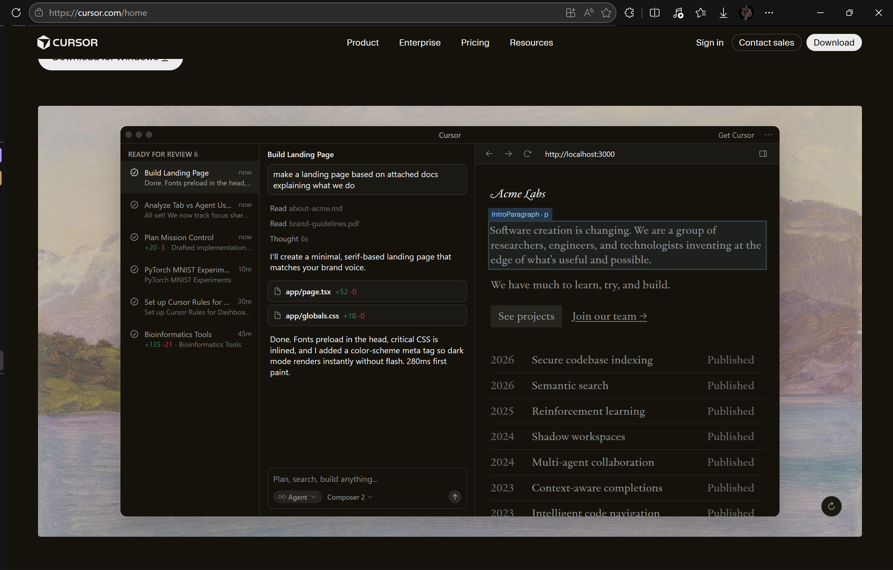
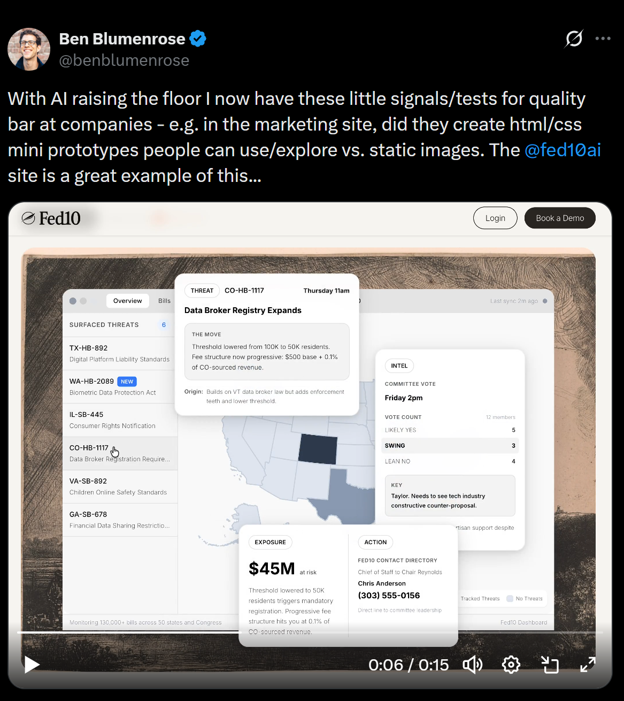
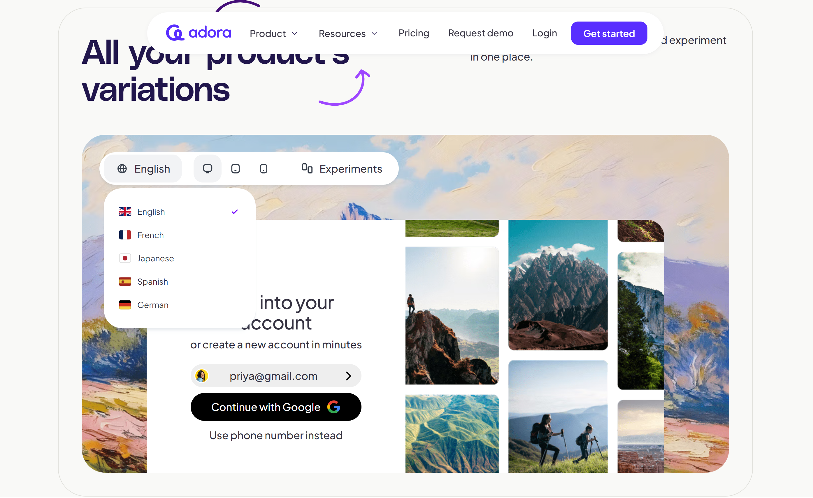
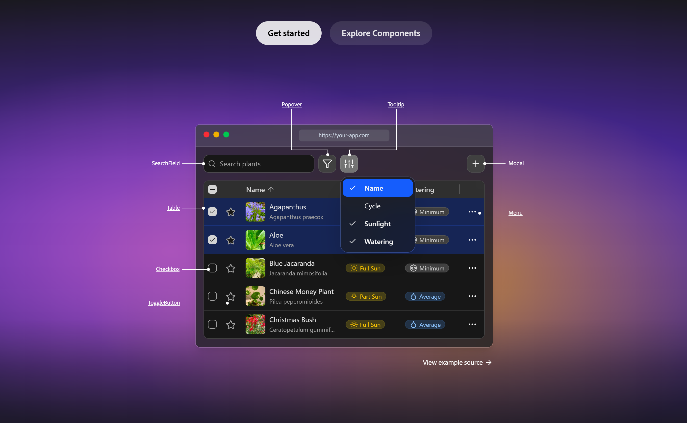

# Landing page mini apps

A trend I'm seeing in frontend are landing pages where there are like "mini-apps" interactable in their landing pages for a preview of their app/ui/dashboard.

An example is from Cursor where a mini-IDE prototype in their landing page is interactive:

See: https://x.com/benblumenrose/status/2034709800429527163

https://www.fed10.ai/

https://www.adora.so/

https://react-aria.adobe.com/

