# Utter: How Everything Works

A complete walkthrough of the Utter codebase, from the React button you click to the GPU that speaks back.

---

## What Utter Does

Utter is a voice cloning and text-to-speech web app. You upload a voice sample (or describe a voice you want), then type text and hear it spoken in that voice. The whole stack is:

- **Frontend**: React 19 + Vite + Tailwind v4, deployed on Vercel
- **Backend**: A single Supabase Edge Function (Deno + Hono router) acting as the API
- **Database**: Supabase Postgres with Row Level Security
- **Storage**: Supabase Storage (private buckets for audio files)
- **GPU/TTS**: Modal.com (Qwen3-TTS) and Alibaba DashScope (Qwen API) for voice synthesis
- **Transcription**: Mistral Voxtral for audio-to-text
- **Billing**: Stripe for credit purchases

Production lives at `https://utter-wheat.vercel.app`.

---

## The Big Picture

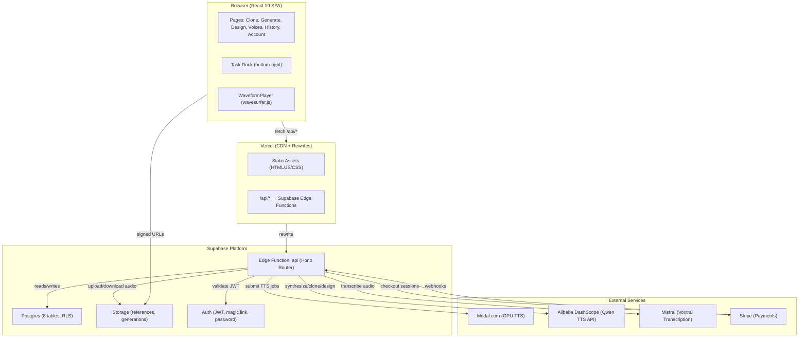

---

## Frontend

### File Structure

```
frontend/src/
├── app/
│   ├── App.tsx              # Root component (providers + router outlet)
│   ├── Layout.tsx           # App shell (header/nav/footer/task dock/theme toggle)
│   ├── Footer.tsx           # Shared footer
│   ├── router.tsx           # All routes defined here
│   ├── RequireAuth.tsx      # Auth guard wrapper
│   ├── useGlobalShortcuts.ts # Keyboard nav (C/G/D keys)
│   └── theme/
│       └── ThemeProvider.tsx # Light/dark mode
├── pages/
│   ├── Landing.tsx          # Public homepage
│   ├── Auth.tsx             # Login / signup
│   ├── Clone.tsx            # Voice cloning (upload or record)
│   ├── Generate.tsx         # Text-to-speech generation
│   ├── Design.tsx           # Voice design from description
│   ├── Voices.tsx           # Browse & manage voices
│   ├── History.tsx          # Past generations
│   ├── hooks.ts             # Shared page hooks
│   ├── account/
│   │   ├── AccountLayout.tsx # Sidebar nav for account pages
│   │   ├── Profile.tsx      # Edit name, handle, avatar
│   │   ├── Usage.tsx        # Credit balance & ledger
│   │   └── Billing.tsx      # Buy credits via Stripe
│   └── landing/
│       ├── LandingHero.tsx  # Hero section
│       ├── DemoWall.tsx     # Demo voice cards
│       ├── FeaturesSection.tsx
│       └── PricingSection.tsx
├── components/
│   ├── ui/                  # Button, Input, Select, Label, Textarea, Message, InfoTip, Kbd
│   ├── audio/
│   │   ├── WaveformPlayer.tsx       # Wavesurfer.js audio player
│   │   └── useWaveformListPlayer.ts # Multi-player coordination
│   ├── tasks/
│       ├── TaskProvider.tsx  # Global task state (context + polling + localStorage)
│       ├── TaskDock.tsx      # Floating task status panel
│       └── TaskBadge.tsx     # Active task count indicator
│   ├── marketing/
│   │   ├── PricingContent.tsx # Shared pricing copy/layout
│   │   └── PricingGrid.tsx    # Reusable pricing cards
│   └── animation/
│       └── TextReveal.tsx     # Landing animation helper
├── lib/
│   ├── api.ts               # apiJson(), apiForm(), apiRedirectUrl() wrappers
│   ├── supabase.ts          # Supabase client init + auth helpers
│   ├── types.ts             # All TypeScript interfaces
│   ├── audio.ts             # PCM encoding, WAV headers, RMS level
│   ├── cn.ts                # clsx + tailwind-merge
│   ├── time.ts              # formatElapsed()
│   ├── storage.ts           # localStorage read/write JSON
│   ├── protectedMedia.ts    # Signed URL resolution + download triggers
│   └── fetchTextUtf8.ts     # Fetch text helper
└── styles/
    ├── geist-pixel.css      # Pixel font-face declarations
    └── index.css            # Tailwind v4 imports + custom properties
```

### Routing

All routes are defined in `router.tsx` with React Router v7. Every page is lazy-loaded for code splitting.

| Path | Page | Auth Required | Purpose |
|------|------|:---:|---------|
| `/` | Landing | No | Marketing homepage with demo voices |
| `/auth` | Auth | No | Login / signup (magic link or password) |
| `/pricing` | Redirect | No | Redirects to `/#pricing` |
| `/clone` | Clone | Yes | Upload or record audio to clone a voice |
| `/generate` | Generate | Yes | Type text, pick a voice, generate speech |
| `/design` | Design | Yes | Describe a voice, preview it, save it |
| `/voices` | Voices | Yes | Browse, search, delete your voices |
| `/history` | History | Yes | View past generations, replay, download |
| `/account` | AccountLayout | Yes | Account section shell (redirects to `/account/profile`) |
| `/account/profile` | Profile | Yes | Edit display name, handle, avatar |
| `/account/usage` | Usage | Yes | Credit balance, usage stats, ledger |
| `/account/billing` | Billing | Yes | Buy credit packs via Stripe |
| `/account/auth` | Redirect | Yes | Redirects to `/auth` |
| `/about` | About | No | Static info page |
| `/privacy` | Privacy | No | Privacy policy |
| `/terms` | Terms | No | Terms of service |

Keyboard shortcuts: press `C` to go to Clone, `G` to Generate, `D` to Design (disabled when typing in form fields).

### How the Frontend Talks to the Backend

All API calls go through `lib/api.ts`:

```
apiJson<T>(path, init?)    → JSON requests with Bearer token
apiForm<T>(path, form)     → FormData/multipart (file uploads)
apiRedirectUrl(path)       → Follow redirects to get signed storage URLs
```

The browser calls `/api/whatever`. Vercel rewrites this to the Supabase Edge Function URL. The Edge Function processes the request and returns JSON (or a redirect to a signed storage URL for audio playback).

### State Management

There's no Redux or Zustand. State lives in:

1. **React Context** for cross-cutting concerns:
   - `TaskProvider` — tracks active clone/generate/design tasks globally
   - `ThemeProvider` — light/dark mode toggle

2. **Local component state** (`useState`) for everything else:
   - Form inputs, file uploads, loading spinners, pagination, search filters

3. **localStorage** for persistence:
   - Active tasks survive page refresh (`utter_task_generate`, `utter_task_clone`, `utter_task_design`)
   - Theme preference (`utter_theme`)
   - Form state for task resumption

4. **URL search params** for shareable/bookmarkable state:
   - Voices page: `?search=&source=&page=`
   - History page: `?search=&status=&page=`
   - Generate page: `?voice=&text=&language=`

### Task Polling (the heartbeat of the app)

Long-running operations (cloning, generating, designing) create server-side tasks. The frontend polls for completion:

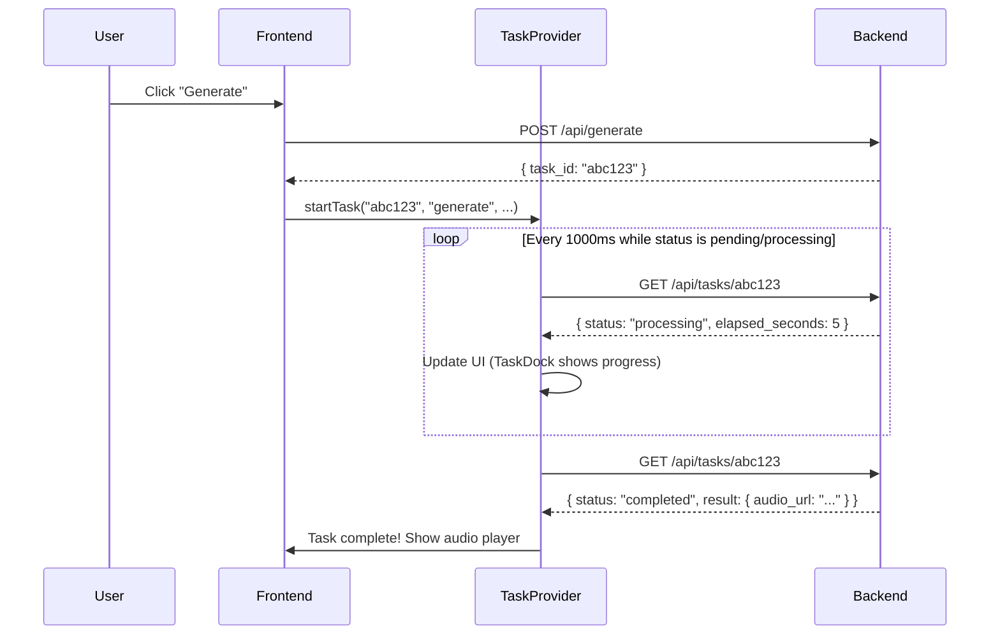

The `TaskDock` component floats in the bottom-right corner showing active tasks with elapsed time. It includes a cancel button only for in-flight **generate** tasks.

### Audio Processing (Clone Page)

When a user records from their microphone on the Clone page:

1. `navigator.mediaDevices.getUserMedia()` captures the mic stream
2. An `AudioContext` with `ScriptProcessor` (or `AudioWorklet`) collects raw PCM samples
3. Samples are downsampled from the mic's native rate (usually 48kHz) to 16kHz mono
4. A WAV file is constructed in-memory with proper RIFF headers
5. The WAV file is uploaded to Supabase Storage via a signed URL

The `WaveformPlayer` component uses wavesurfer.js to render interactive waveforms for playback. Multiple players on the same page coordinate so only one plays at a time.

Note: clone finalization enforces a 10MB reference-audio limit server-side.

---

## Backend

### The "Fat Function" Architecture

The entire backend is a single Supabase Edge Function named `api`. It runs on Deno and uses the Hono framework as its router. There is no separate server, no containers, no Lambda functions — just one Edge Function handling all routes.

```
supabase/functions/
├── api/
│   ├── index.ts              # Hono router entry point + middleware
│   └── routes/
│       ├── clone.ts          # POST /clone/upload-url, POST /clone/finalize
│       ├── generate.ts       # POST /generate
│       ├── voices.ts         # GET /voices, GET /voices/:id/preview, DELETE /voices/:id
│       ├── tasks.ts          # GET /tasks/:id, POST /tasks/:id/cancel, DELETE /tasks/:id
│       ├── generations.ts    # GET /generations, GET /generations/:id/audio, DELETE /generations/:id, POST /generations/:id/regenerate
│       ├── design.ts         # POST /voices/design/preview, POST /voices/design
│       ├── transcriptions.ts # POST /transcriptions
│       ├── me.ts             # GET /me, PATCH /profile
│       ├── credits.ts        # GET /credits/usage
│       ├── billing.ts        # POST /billing/checkout, POST /webhooks/stripe
│       └── languages.ts      # GET /languages
└── _shared/
    ├── auth.ts               # requireUser() — JWT validation
    ├── cors.ts               # CORS headers (handled before any throwing code)
    ├── supabase.ts           # createUserClient(), createAdminClient()
    ├── credits.ts            # applyCreditEvent(), trialOrDebit(), trialRestore()
    ├── rate_limit.ts         # 3-tier rate limiting via Postgres RPC
    ├── modal.ts              # Modal.com API client (job submit/poll/result/cancel)
    ├── mistral.ts            # Mistral Voxtral transcription client
    ├── urls.ts               # Storage URL resolution (local dev vs production)
    └── tts/
        ├── provider.ts       # Provider config (modal vs qwen mode switching)
        └── providers/
            ├── modal.ts               # Modal provider adapter
            ├── qwen.ts                # Qwen provider adapter
            ├── qwen_customization.ts  # Voice clone + design via DashScope API
            ├── qwen_synthesis.ts      # TTS synthesis via DashScope API
            ├── qwen_audio.ts          # Audio download with retry
            └── errors.ts              # ProviderError normalization
```

### Request Lifecycle

Every API request goes through this pipeline:

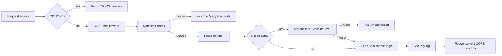

### Rate Limiting

Three tiers, enforced via a Postgres RPC function (`rate_limit_check_and_increment`):

| Tier | Endpoints | Per-User Limit | Per-IP Limit | Window |
|------|-----------|:-:|:-:|:-:|
| **tier1** (heavy) | `/generate`, `/clone/*`, `/voices/design*`, `/billing/checkout`, `/transcriptions` | 20 | 120 | 5 min |
| **tier2** (polling/task ops) | `/tasks/:id`, `/tasks/:id/cancel`, `DELETE /tasks/:id` | 90 | 180 | 5 min |
| **tier3** (reads) | Everything else | Unlimited | 300 | 5 min |

IPs are SHA-256 hashed before storage. Rate limit state lives in a Postgres table (not in-memory), so it survives function restarts.

### Every API Endpoint

#### Health

| Method | Path | What it does |
|--------|------|-------------|
| `GET` | `/health` | Lightweight health check that returns `{ ok: true }`. |

#### Clone

| Method | Path | What it does |
|--------|------|-------------|
| `POST` | `/clone/upload-url` | Returns a signed URL to upload reference audio to Supabase Storage. Creates the voice ID. |
| `POST` | `/clone/finalize` | After the audio is uploaded, this finalizes the voice. Debits 1,000 credits (or uses a free trial). For Qwen provider, calls the DashScope voice enrollment API. |

#### Generate

| Method | Path | What it does |
|--------|------|-------------|
| `POST` | `/generate` | Takes voice_id + text + language. Debits 1 credit per character. Creates a task and generation record. For Modal: submits GPU job immediately. For Qwen: runs synthesis in background via `EdgeRuntime.waitUntil()`. Returns task_id for polling. |

#### Design

| Method | Path | What it does |
|--------|------|-------------|
| `POST` | `/voices/design/preview` | Takes a text description of a voice + preview text. Debits 5,000 credits (or uses a free trial). Creates a task. For Qwen: calls DashScope voice design API in background. For Modal: triggers design on first poll. Returns task_id. |
| `POST` | `/voices/design` | Saves a successfully designed voice permanently. For Qwen: pulls provider metadata from the completed task. For Modal: accepts an audio file upload. |

#### Voices

| Method | Path | What it does |
|--------|------|-------------|
| `GET` | `/voices` | Lists the user's voices with pagination, search, and source filter (uploaded vs designed). |
| `GET` | `/voices/:id/preview` | Returns a 302 redirect to the signed storage URL for the voice's reference audio. |
| `DELETE` | `/voices/:id` | Soft-deletes a voice (sets `deleted_at`). |

#### Tasks

| Method | Path | What it does |
|--------|------|-------------|
| `GET` | `/tasks/:id` | The polling endpoint. For Modal tasks: checks job status via Modal API, downloads result on completion, uploads to storage. For Qwen tasks: returns current provider status (background processing updates the DB directly). Returns elapsed time, status, errors. |
| `POST` | `/tasks/:id/cancel` | Cancels a pending/processing task. Refunds credits. For Modal: calls Modal cancel API. For Qwen: sets `cancellation_requested` flag. |
| `DELETE` | `/tasks/:id` | Hard-deletes a task record. |

#### Generations

| Method | Path | What it does |
|--------|------|-------------|
| `GET` | `/generations` | Lists past generations with pagination, search, and status filter. |
| `GET` | `/generations/:id/audio` | Returns a 302 redirect to the signed storage URL for the generated audio. |
| `DELETE` | `/generations/:id` | Deletes a generation and its audio file from storage. |
| `POST` | `/generations/:id/regenerate` | Returns the original voice_id + text + language so the UI can pre-fill the Generate form. |

#### Transcription

| Method | Path | What it does |
|--------|------|-------------|
| `POST` | `/transcriptions` | Accepts an audio file (WAV/MP3/M4A, max 50MB). Sends it to Mistral Voxtral for transcription. Returns `{ text, model, language }`. |

#### User & Profile

| Method | Path | What it does |
|--------|------|-------------|
| `GET` | `/me` | Returns current user info + profile. Auto-creates profile if missing. Works without auth (returns `signed_in: false`). |
| `PATCH` | `/profile` | Updates handle, display_name, or avatar_url. |

#### Credits

| Method | Path | What it does |
|--------|------|-------------|
| `GET` | `/credits/usage` | Returns credit balance, usage totals for a time window, trial counts, rate card, and last 20 ledger events. |

#### Billing

| Method | Path | What it does |
|--------|------|-------------|
| `POST` | `/billing/checkout` | Creates a Stripe checkout session for a credit pack (150K credits / $10 or 500K credits / $25). Returns the Stripe checkout URL. |
| `POST` | `/webhooks/stripe` | Receives Stripe webhook events. On `checkout.session.completed`: validates signature, grants credits, records in billing_events + credit_ledger. |

#### Languages

| Method | Path | What it does |
|--------|------|-------------|
| `GET` | `/languages` | Returns supported languages, default language, current provider mode, TTS capabilities (max chars, etc.), and transcription config. No auth required. |

---

## Database

### Schema Diagram

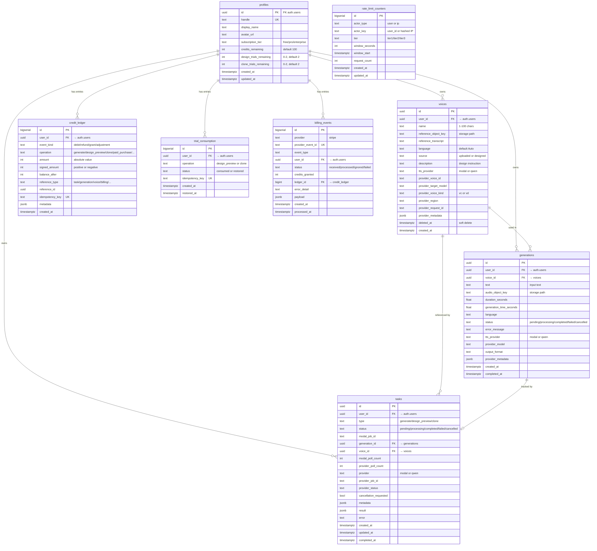

### Row Level Security (RLS)

Every table has RLS enabled. The security model follows a simple principle: **users can read only their own data; most writes are server-owned, with user deletes allowed for voices and generations**.

| Table | User Can | Server (Service Role) Can |
|-------|----------|---------------------------|
| **profiles** | SELECT own row | UPDATE (via edge function) |
| **voices** | SELECT own, DELETE own | INSERT, UPDATE |
| **generations** | SELECT own, DELETE own | INSERT, UPDATE |
| **tasks** | SELECT own | INSERT, UPDATE, DELETE |
| **credit_ledger** | SELECT own | INSERT, UPDATE, DELETE |
| **trial_consumption** | Nothing | Everything |
| **billing_events** | Nothing | Everything |
| **rate_limit_counters** | Nothing | Everything |

Direct PostgREST writes (INSERT/UPDATE) are revoked from the `authenticated` role for voices, generations, tasks, and profiles. This means even if someone bypasses the Edge Function and calls the Supabase REST API directly, they can't create or modify records — only read their own.

### Storage Buckets

| Bucket | Privacy | Max Size | Allowed Types | Path Pattern |
|--------|:-------:|:--------:|---------------|-------------|
| `references` | Private | 10 MB | audio/wav, audio/x-wav, audio/mpeg, audio/mp4, audio/m4a | `{user_id}/{voice_id}/reference.wav` |
| `generations` | Private | Default | Any | `{user_id}/{generation_id}.wav` |

Storage RLS ensures users can only read files in their own `{user_id}/` prefix. Uploads to `generations` are done by the service role (edge function), not the user directly. Uploads to `references` use signed URLs that the edge function generates.

### Database Functions (RPCs)

These are Postgres functions called by the edge function via `supabase.rpc()`:

| Function | Purpose |
|----------|---------|
| `credit_apply_event(...)` | Atomically debit/credit the user's balance. Returns `{ applied, insufficient, balance_remaining, ledger_id }`. Uses idempotency keys to prevent double-charging. |
| `trial_or_debit(...)` | Uses a free trial if available, otherwise debits credits. Returns `{ used_trial, insufficient, ... }`. |
| `trial_restore(...)` | Restores a consumed trial on failure (e.g., task cancellation). |
| `credit_usage_window_totals(...)` | Sums debits and credits within a time window for the Usage page. |
| `rate_limit_check_and_increment(...)` | Atomically checks and increments rate limit counters. Returns `{ allowed, current_count, retry_after_seconds }`. |
| `increment_task_modal_poll_count(...)` | Increments a task's poll counter. |
| `handle_new_user()` | Trigger: auto-creates a profile row when a user signs up. |
| `handle_updated_at()` | Trigger: sets `updated_at = now()` on row updates. |

---

## Feature Flows

### Voice Cloning

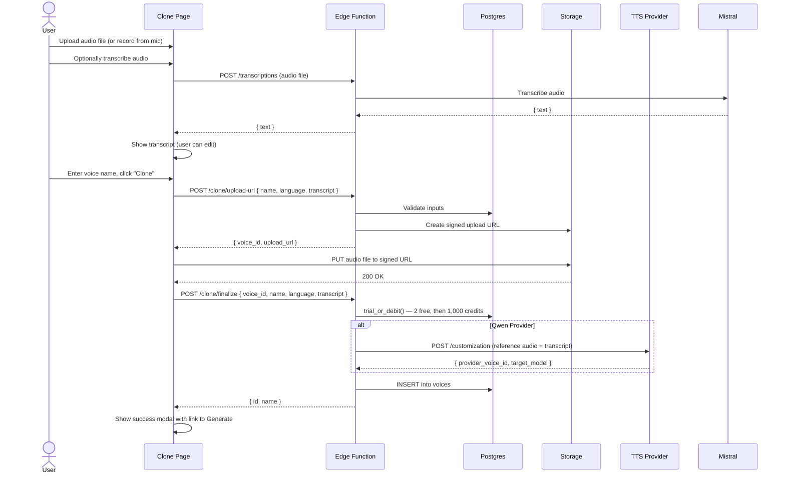

### Voice Design

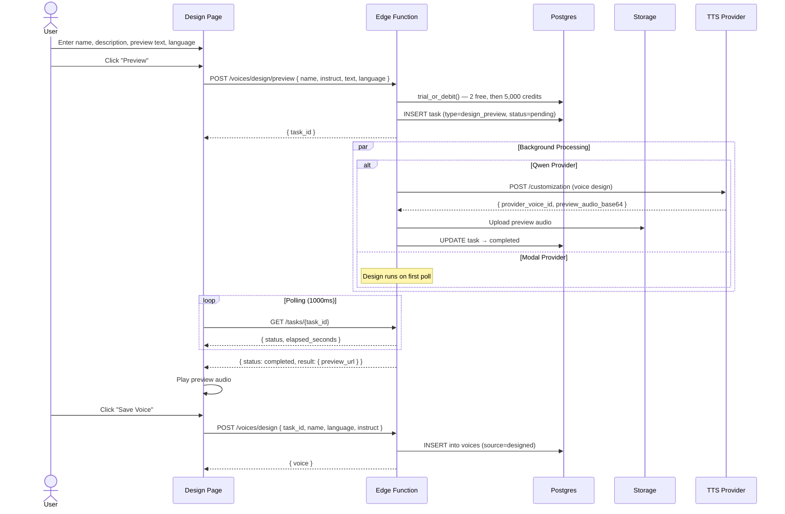

### Text-to-Speech Generation

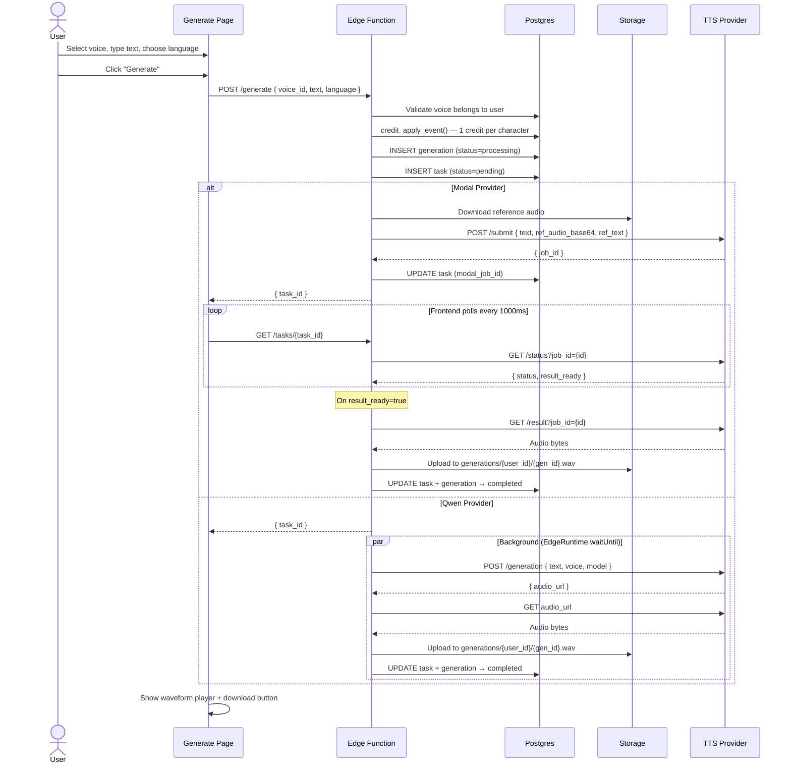

### Credit System

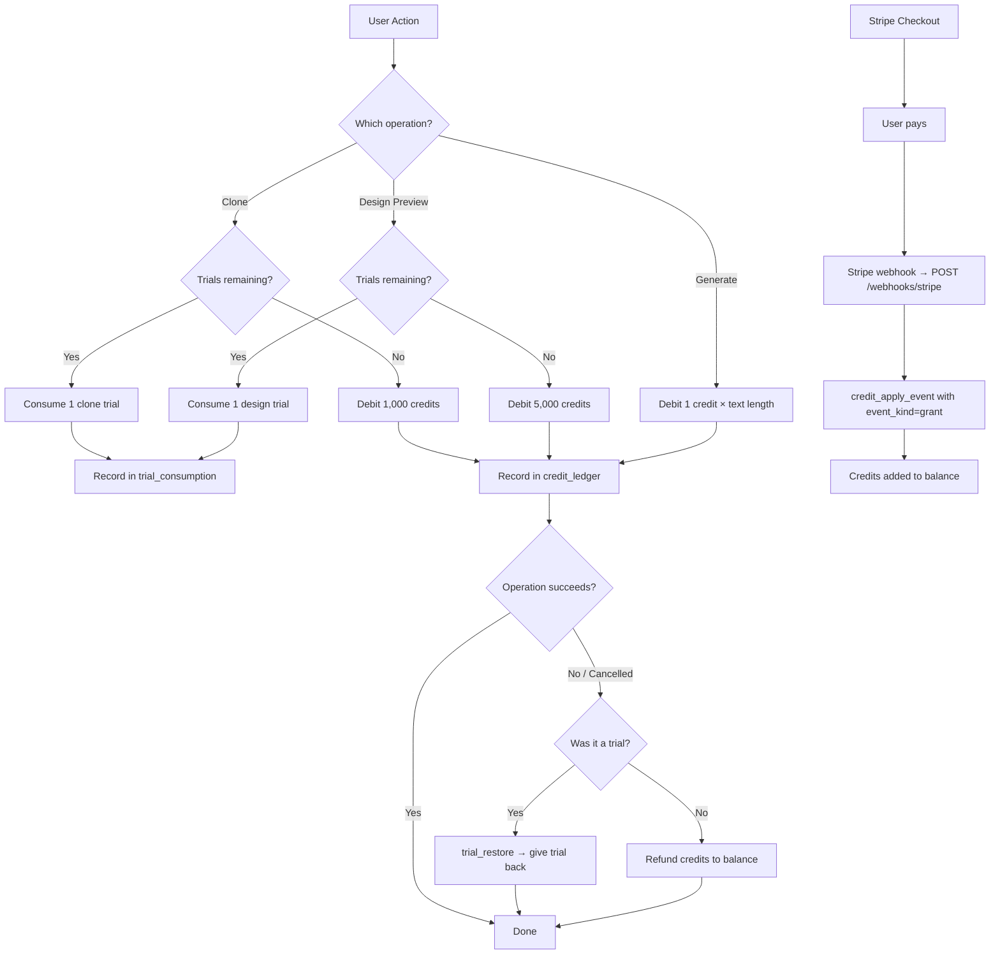

**Rate Card:**

| Operation | Cost |
|-----------|------|
| Generate | 1 credit per input character |
| Clone voice | Free first 2, then 1,000 credits |
| Design preview | Free first 2, then 5,000 credits |
| Credit Pack A | 150,000 credits / $10 |
| Credit Pack B | 500,000 credits / $25 |

All credit operations use **idempotency keys** so retries never double-charge. The `credit_ledger` table is an immutable append-only log of every transaction.

### Authentication

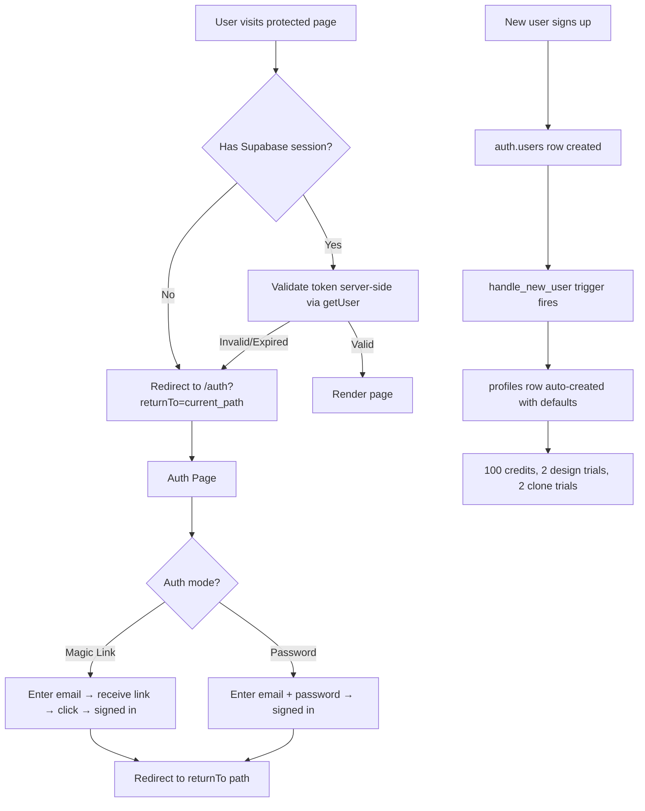

### Task State Machine

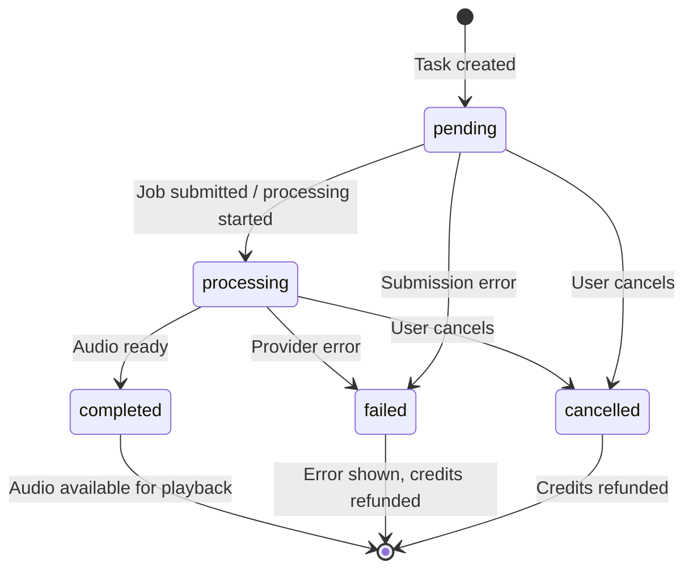

Only one active `generate` task per user at a time (enforced by a unique partial index).

---

## External Services

### Modal.com (GPU TTS)

Modal provides GPU compute for the Qwen3-TTS model. The edge function communicates with Modal via HTTP endpoints:

| Endpoint | Purpose |
|----------|---------|
| `MODAL_JOB_SUBMIT` | Submit a TTS job with text + reference audio (base64) |
| `MODAL_JOB_STATUS` | Check if a job is still running |
| `MODAL_JOB_RESULT` | Download the generated audio bytes |
| `MODAL_JOB_CANCEL` | Cancel a running job |
| `MODAL_ENDPOINT_VOICE_DESIGN` | Design a voice from a text description |

The Modal flow is asynchronous: submit a job, get a job_id, poll for completion, then download the result. The edge function does the polling on behalf of the frontend (the frontend polls the edge function, which polls Modal).

### Alibaba DashScope (Qwen TTS API)

An alternative TTS provider that provides voice cloning, voice design, and synthesis as a managed API (no GPU management needed):

| API | Purpose |
|-----|---------|
| `/customization` (voice enrollment) | Clone a voice from reference audio + transcript |
| `/customization` (voice design) | Design a voice from a text description |
| `/generation` | Synthesize text to speech using a cloned/designed voice |

The Qwen flow is more synchronous — synthesis returns an audio URL that the edge function downloads. Processing happens in the background via `EdgeRuntime.waitUntil()`.

### Mistral Voxtral (Transcription)

Used on the Clone page to transcribe uploaded audio into text. The transcript is required for Qwen voice cloning and optional for Modal.

- Model: `voxtral-mini-2602`
- Supports 10 languages (en, zh, ja, ko, de, fr, ru, pt, es, it)
- Max file size: 50MB

### Stripe (Payments)

Handles credit pack purchases:

1. Frontend calls `POST /billing/checkout` with the pack choice
2. Edge function creates a Stripe checkout session and returns the URL
3. User completes payment on Stripe's hosted checkout page
4. Stripe sends a webhook to `POST /webhooks/stripe`
5. Edge function validates the webhook signature, grants credits, and records the event

---

## Security Model

### Defense in Depth

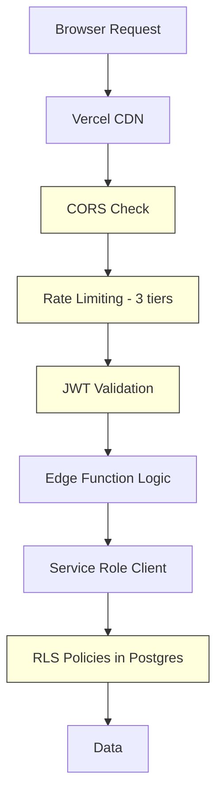

1. **CORS**: Origin handling is configurable (`CORS_ALLOWED_ORIGIN`), with support for strict allowlists or `*`
2. **Rate Limiting**: Per-user and per-IP limits stored in Postgres
3. **JWT Validation**: Supabase Auth verifies tokens, edge function calls `auth.getUser()`
4. **RLS**: Even if all other layers fail, Postgres enforces that users only see their own data
5. **Revoked Grants**: Direct PostgREST writes are disabled for sensitive tables
6. **Idempotency**: Credit operations use unique keys to prevent replay attacks
7. **Signed URLs**: Audio files are accessed via time-limited signed URLs, not public URLs
8. **Webhook Verification**: Stripe webhooks are HMAC-SHA256 verified
9. **IP Hashing**: Rate limit counters store SHA-256 hashes of IPs, not raw IPs
10. **Provider Errors Normalized**: Internal provider details are never exposed to users

### Two Supabase Clients

The edge function uses two different Supabase clients:

- **User Client** (`createUserClient(req)`): Uses the user's JWT from the `Authorization` header. Subject to RLS. Used for reads where the user should only see their own data.
- **Admin Client** (`createAdminClient()`): Uses the `SERVICE_ROLE_KEY`. Bypasses RLS. Used for writes (inserting tasks, updating generations, uploading to storage).

---

## Environment Variables

### Edge Function (Supabase Secrets)

| Variable | Purpose |
|----------|---------|
| `SUPABASE_URL` | Supabase project URL |
| `SUPABASE_ANON_KEY` | Public anon key |
| `SUPABASE_SERVICE_ROLE_KEY` | Admin key (bypasses RLS) |
| `SUPABASE_PUBLIC_URL` | Optional public origin override for local signed-URL rewriting |
| `TTS_PROVIDER_MODE` | `modal` or `qwen` — which TTS backend to use |
| `MODAL_JOB_SUBMIT` | Modal.com job submission URL |
| `MODAL_JOB_STATUS` | Modal.com status check URL |
| `MODAL_JOB_RESULT` | Modal.com result download URL |
| `MODAL_JOB_CANCEL` | Modal.com job cancel URL |
| `MODAL_ENDPOINT_VOICE_DESIGN` | Modal.com voice design URL |
| `DASHSCOPE_API_KEY` | Alibaba DashScope API key |
| `DASHSCOPE_BASE_URL` | DashScope API base URL |
| `DASHSCOPE_REGION` | DashScope region selection (`intl` or `cn`) |
| `QWEN_VC_TARGET_MODEL` | Override Qwen clone target model |
| `QWEN_VD_TARGET_MODEL` | Override Qwen design target model |
| `QWEN_MAX_TEXT_CHARS` | Max generate text length in qwen mode (default 600) |
| `MISTRAL_API_KEY` | Mistral API key for transcription |
| `MISTRAL_SERVER_URL` | Optional Mistral base URL override |
| `MISTRAL_TRANSCRIBE_MODEL` | Optional transcription model override |
| `TRANSCRIPTION_ENABLED` | Enable/disable transcription endpoints |
| `STRIPE_SECRET_KEY` | Stripe secret key |
| `STRIPE_WEBHOOK_SECRET` | Stripe webhook signing secret |
| `STRIPE_PRICE_PACK_150K` | Stripe Price ID for 150K credit pack |
| `STRIPE_PRICE_PACK_500K` | Stripe Price ID for 500K credit pack |
| `CORS_ALLOWED_ORIGIN` | Comma-separated allowed origins |
| `RATE_LIMIT_WINDOW_SECONDS` | Global default rate-limit window (seconds) |
| `RATE_LIMIT_TIER1_USER_LIMIT` / `RATE_LIMIT_TIER1_IP_LIMIT` / `RATE_LIMIT_TIER1_WINDOW_SECONDS` | Tier1 overrides |
| `RATE_LIMIT_TIER2_USER_LIMIT` / `RATE_LIMIT_TIER2_IP_LIMIT` / `RATE_LIMIT_TIER2_WINDOW_SECONDS` | Tier2 overrides |
| `RATE_LIMIT_TIER3_IP_LIMIT` / `RATE_LIMIT_TIER3_WINDOW_SECONDS` | Tier3 overrides |

### Frontend (Vite)

| Variable | Purpose |
|----------|---------|
| `VITE_SUPABASE_URL` | Supabase project URL (public) |
| `VITE_SUPABASE_ANON_KEY` | Supabase anon key (public) |

---

## Local Development

```bash
# Start Supabase locally (Postgres, Auth, Storage, Studio)
supabase start

# Serve the edge function with hot reload
npm run sb:serve

# Start the frontend dev server
cd frontend && npm run dev

# Run database tests
npm run test:db

# Run edge function tests
npm run test:edge

# Reset database (replays all migrations + seed)
npm run sb:reset
```

- Local Supabase Studio: `http://localhost:54323`
- Local API: `http://localhost:54321/functions/v1/api/`
- Frontend dev server: `http://localhost:5173`
- Vercel rewrites are not used locally — the frontend Vite config proxies `/api` calls to the local Supabase function.

---

## Key Design Decisions

1. **Single Edge Function ("fat function")**: All routes live in one function to share code (auth, credits, rate limiting) and avoid cold-start overhead across multiple functions.

2. **Polling over WebSockets**: TTS jobs take 5-60+ seconds. Rather than maintaining WebSocket connections (which don't work well with stateless edge functions), the frontend polls every 1000ms. Simple, reliable, and works with Supabase's stateless Deno runtime.

3. **Dual TTS providers**: Modal (self-hosted GPU) and Qwen (managed API) are both supported. The `TTS_PROVIDER_MODE` env var switches between them. Voice records store which provider they were created with, so you can't mix providers within a voice.

4. **Credits with trials**: New users get 2 free clones and 2 free design previews to try the product without buying credits. After that, operations cost credits. This is all enforced atomically in Postgres via RPC functions.

5. **Immutable credit ledger**: Every credit transaction is recorded. Balances can be reconstructed from the ledger. Idempotency keys prevent double-charging even on retries.

6. **RLS + revoked grants**: Defense in depth. Even if the edge function has a bug, Postgres won't let users access other users' data or write directly to sensitive tables.

7. **Soft deletes for voices**: Voices are soft-deleted (`deleted_at` timestamp) so storage cleanup can happen asynchronously and references from existing generations aren't broken.

8. **Signed URLs for audio**: Audio files are never publicly accessible. The edge function generates short-lived signed URLs that the browser uses for playback/download.
